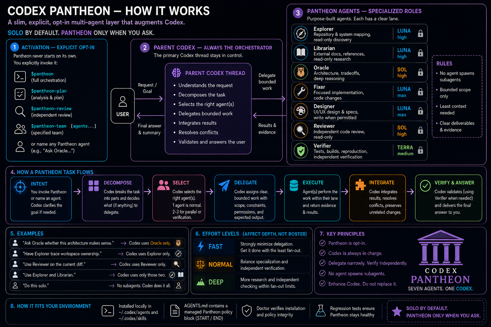

# Codex Pantheon

**Codex Pantheon is a slim, explicit, Codex-native multi-agent layer.**

Pantheon gives Codex a small set of specialist agents plus thin planning, review, and parallel-team workflows without replacing Codex with a separate orchestration framework.

> Enhance Codex. Don't replace it.



## v0.2.0

v0.2 adds coordination and reliability while preserving Pantheon's original constraints:

- ordinary Codex stays solo by default;
- Pantheon activates only when you explicitly request it, then remains active for that thread until you explicitly disable it;
- the parent Codex thread remains the orchestrator;
- child agents receive bounded assignments and cannot recursively spawn Pantheon agents;
- one specialist is preferred over unnecessary fan-out;
- independent review/verification is available when it materially improves confidence;
- no daemon, task database, scheduler, HUD, or custom orchestration runtime is introduced.

See `docs/DESIGN_DOCTRINE.md` and `docs/V0.2.0.md`.

## Documentation

- [User guide](docs/USER_GUIDE.md) — activation, effort levels, workflows, specialists, examples, and evidence boundaries.
- [Codex-assisted install guide](docs/CODEX_INSTALL.md) — installation, update, repair, verification, and removal.
- [CLI reference](docs/CLI_REFERENCE.md) — commands, environment variables, owned paths, outcomes, and safeguards.
- [Design doctrine](docs/DESIGN_DOCTRINE.md) — the principles and slim-test that govern the project.
- [Contributing](CONTRIBUTING.md) — development setup, change constraints, validation, and pull-request expectations.
- [Release checklist](docs/RELEASING.md) — version synchronization, validation, and publication boundaries.
- [Support](SUPPORT.md) — diagnostics and useful bug-report details.
- [Security policy](SECURITY.md) — private vulnerability reporting and security-sensitive boundaries.
- [Changelog](CHANGELOG.md) — release history.

## Core agents

| Agent | Purpose | Default model | Reasoning | Default write posture |
| --- | --- | --- | --- | --- |
| `pantheon_explorer` | Repository/system mapping, execution-path tracing, evidence | `gpt-5.6-luna` | `high` | Read-only |
| `pantheon_librarian` | Docs, APIs, standards, upstream/reference research | `gpt-5.6-luna` | `high` | Read-only |
| `pantheon_oracle` | Architecture, tradeoffs, difficult reasoning | `gpt-5.6-sol` | `high` | Read-only |
| `pantheon_fixer` | Focused implementation | `gpt-5.6-luna` | `max` | Workspace write |
| `pantheon_designer` | UI/UX critique or explicitly authorized UI implementation | `gpt-5.6-luna` | `max` | Assignment-dependent |
| `pantheon_reviewer` | Independent correctness/regression/security review | `gpt-5.6-sol` | `high` | Read-only |
| `pantheon_verifier` | Tests, builds, reproduction, acceptance evidence | `gpt-5.6-terra` | `medium` | No production-source edits |

All seven v0.2 agent roles pin explicit model and reasoning defaults.

## Workflow skills

Invoke Pantheon explicitly. The invocation activates a thread-scoped mode, so later messages in the same thread remain in Pantheon without repeating `$pantheon`:

```text
$pantheon

Implement this feature.
fix the failing tests
review the implementation
address the review findings
```

Activation can also happen midway through a thread:

```text
Explain how this subsystem works.

$pantheon

Now implement the refactor.
verify the implementation
```

The first request uses ordinary Codex behavior. Pantheon becomes active at `$pantheon` and remains active for the following request. A clear natural-language request such as `use Pantheon for this` also activates the current thread.

Effort is sticky while Pantheon is active. Select the skill with `$pantheon`, then express the effort as ordinary language:

```text
$pantheon

Use deep orchestration for this task.
```

Once Pantheon is active, change its effort without invoking the skill again:

```text
switch Pantheon to fast
use normal Pantheon effort
switch Pantheon to deep
```

Activation without an effort instruction starts at `normal`. A repeated bare `$pantheon` while active preserves the current effort. Disabling Pantheon clears that selection, so a later bare `$pantheon` starts again at `normal`.

To leave Pantheon mode, state that intent clearly:

```text
stop using Pantheon
```

Subsequent messages use normal non-Pantheon behavior until Pantheon is explicitly activated again. Activation and effort never carry into a new thread.

The specialized workflows remain available for an explicit request without becoming sticky submodes:

```text
$pantheon-plan plan the multi-workspace migration without implementing it
$pantheon-review review this branch against main
$pantheon-team split this migration into independent workstreams
```

You can also name an agent directly in natural language, for example:

```text
Use Pantheon Explorer to map the authentication flow.
Use Pantheon Reviewer to independently inspect the current diff.
```

Pantheon does not activate merely because a task looks difficult. Thread persistence is a conversational contract interpreted from explicit activation and deactivation in that thread; Pantheon does not add a daemon, database, global preference, or cross-thread state store.

## Install with Codex (recommended)

Open the Pantheon source directory as your Codex workspace and simply ask:

```text
Install Codex Pantheon for me.
```

This is an ordinary Codex lifecycle request: it operates on Pantheon and leaves Pantheon mode OFF. By contrast, `$pantheon` followed by an implementation request explicitly activates orchestration, and `Use Pantheon to update the Pantheon installer.` combines explicit activation with a Pantheon operation.

The repository instructions direct Codex to run the bounded bootstrap flow:

```bash
./pantheon bootstrap
```

`bootstrap` installs or refreshes Pantheon-owned files and immediately runs `doctor`. If a safety check fails, Codex is instructed to report the failure instead of bypassing Pantheon's safeguards with manual overwrites. See `docs/CODEX_INSTALL.md`.

### Manual install

From the Pantheon source directory:

```bash
./pantheon install
./pantheon doctor
```

The v0.1-compatible entry point still works:

```bash
./install.sh
```

Pantheon installs:

- custom agent TOMLs into `${CODEX_HOME:-~/.codex}/agents/`;
- workflow skills into `${PANTHEON_SKILLS_HOME:-~/.agents/skills}`;
- one managed policy block into `${CODEX_HOME:-~/.codex}/AGENTS.md`;
- a small version marker at `${CODEX_HOME:-~/.codex}/.pantheon-version`.

Those exact Pantheon-named agent files and skill directories are Pantheon-owned: install/update replaces them and uninstall removes them without making backups. Move unrelated content using the same names before installing. Other agent names, other skills, and text outside Pantheon's managed `AGENTS.md` markers remain user-owned. See the [CLI reference](docs/CLI_REFERENCE.md#owned-paths).

Agent files are copied as regular files. Pantheon does not install custom agent roles as symlinks.

The installer is idempotent: running it repeatedly should produce the same installed state without duplicating the managed `AGENTS.md` block.

## Bootstrap / Update

For Codex-assisted setup and the simplest manual install-or-update flow:

```bash
./pantheon bootstrap
```

For an explicit update after replacing/pulling the Pantheon source with a newer version:

```bash
./pantheon update
```

`update` replaces only Pantheon-owned agent/skill files and Pantheon's managed `AGENTS.md` block. Text outside the markers remains user-owned.

## Doctor

```bash
./pantheon doctor
```

Doctor is read-only. It checks:

- source package completeness;
- installed version marker;
- all seven custom-agent files;
- regular-file/no-symlink status;
- agent and skill drift against this package;
- all four workflow skills;
- managed `AGENTS.md` marker integrity and content;
- possible legacy/unmanaged Pantheon text;
- whether a Codex executable can be found and its reported version.

Doctor validates the installation, not the live Codex service/backend. A healthy doctor result therefore does not claim that a real subagent spawn has been exercised successfully in the current Codex build/provider.

## Uninstall

```bash
./pantheon uninstall
```

Uninstall removes only Pantheon-owned agent files, Pantheon skill directories, the Pantheon managed block, and the Pantheon version marker. Other Codex configuration and other skills are preserved.

## Managed `AGENTS.md` policy

Pantheon owns only the region bounded by:

```text
<!-- PANTHEON:START -->
...
<!-- PANTHEON:END -->
```

If the markers are malformed or duplicated, install/update/uninstall refuses to rewrite `AGENTS.md` rather than guessing.

### Upgrading from v0.1

If v0.1 left unmarked Pantheon instructions in `~/.codex/AGENTS.md`, v0.2 intentionally does not delete them because they are indistinguishable from user-owned text. Install v0.2, run `./pantheon doctor`, then review any legacy-warning text manually once the managed block is present.

## Configuration locations

Pantheon honors `CODEX_HOME` for Codex-owned files:

```bash
CODEX_HOME=/tmp/codex-home ./pantheon install
```

For tests or unusual environments, the skill root can be overridden with:

```bash
PANTHEON_SKILLS_HOME=/tmp/skills ./pantheon install
```

## Development validation

Run:

```bash
./tests/test.sh
```

The test suite uses isolated temporary homes and does not touch your real Codex configuration.

## What Pantheon intentionally does not do

Core Pantheon has no:

- automatic prompt interception or mode detection;
- proactive activation on ordinary Codex prompts;
- recursive child-agent orchestration;
- background daemon or service;
- persistent mission/task database;
- tmux/worktree scheduler;
- orchestration dashboard/HUD;
- token or rate-limit manager;
- large agent marketplace;
- custom MCP orchestration server.

If a future feature requires Pantheon to become its own agent platform rather than improving native Codex delegation, it fails the project's slim test by default.

## License

Codex Pantheon is available under the [MIT License](LICENSE).
