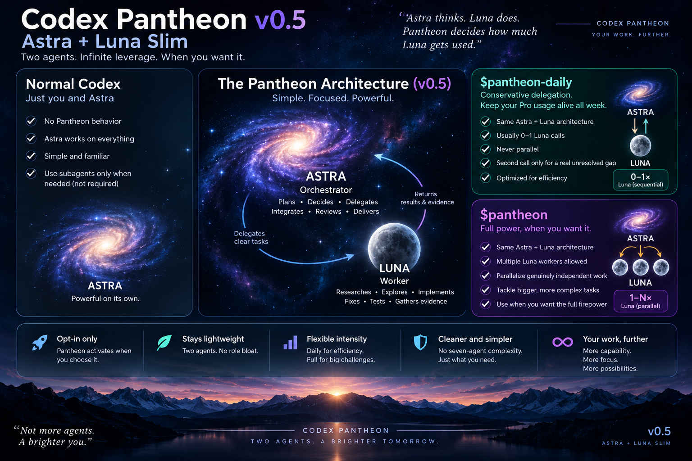

**Codex Pantheon is a slim, explicit, Codex-native delegation layer for an Astra-led Codex session.**

<p align="center">
  
</p>

Pantheon v0.5 has two roles:

- **GPT-6 Astra — main thread / orchestrator.** Plans, decides, integrates, reviews, validates the final result, and talks to you.
- **GPT-5.6 Luna — `pantheon_worker`.** Explores, researches, implements, fixes, and runs focused validation when Astra delegates bounded work.

> **Astra thinks. Luna does. Pantheon controls how much Luna Astra is allowed to use.**

Astra is not installed as a Pantheon subagent. It remains your selected main Codex model. Pantheon installs exactly one custom child-agent definition: `pantheon_worker`.



## v0.5.0 — Astra + Luna Slim

v0.5 is the architecture simplification release:

- collapses the seven v0.4 specialist subagents into one universal Luna worker;
- keeps Astra in the main thread instead of creating an orchestrator child;
- makes `$pantheon-daily` the conservative day-to-day profile: normally 0-1 Luna calls and no parallel workers;
- makes `$pantheon` the higher-intensity profile: multiple Luna calls are allowed when useful, including parallel workers for genuinely independent workstreams;
- keeps planning, architecture, integration, review, and final verification judgment with Astra;
- removes the old Fixer/Explorer/Librarian/Oracle/Designer/Reviewer/Verifier routing ceremony;
- removes the redundant `$pantheon-team` workflow because full Pantheon already owns justified parallelism;
- removes fast/normal/deep effort levels: **Daily and full Pantheon are now the two intensity controls**;
- preserves explicit activation, thread-local state, bounded child context, and solo-by-default Codex behavior;
- automatically removes the old v0.4 Pantheon-owned agent files and `pantheon-team` skill on install/update.

See [the v0.5 release notes](docs/V0.5.0.md) and [design doctrine](docs/DESIGN_DOCTRINE.md).

## Operating profiles

| Profile | Activation | What happens |
| --- | --- | --- |
| Ordinary Codex | default | No Pantheon delegation. Astra/main thread works normally. |
| Pantheon Daily | `$pantheon-daily` | Conservative delegation. Zero Luna calls is fine; normally 0-1 call per request; no parallel workers. |
| Full Pantheon | `$pantheon` | Higher-intensity delegation. Astra may use multiple Luna workers and parallelize genuinely independent workstreams. |

Both Pantheon profiles are sticky only inside the current thread. Invoke the other profile to switch. Say `stop using Pantheon` to return to ordinary Codex. Nothing persists across threads.

Installation, discussion, documentation, `doctor`, and other Pantheon lifecycle work do **not** activate orchestration. Pantheon is used only when you explicitly select it.

### Pantheon Daily

```text
$pantheon-daily

Implement the settings change and run the focused tests.
```

Daily is designed to stretch usage. Astra should do cheap, well-understood work directly and call Luna only when delegation materially saves context, exploration time, implementation work, or execution effort. Prefer one cohesive Luna assignment over multiple specialist-style handoffs.

### Full Pantheon

```text
$pantheon

Implement the storage migration. Split independent server/client work only if parallel Luna workers materially help.
```

Full Pantheon uses the same Astra/Luna architecture with fewer delegation constraints. Parallelism belongs here; there is no separate team mode.

## The worker

Pantheon installs one agent file:

| Agent | Model | Reasoning | Permission posture | Purpose |
| --- | --- | --- | --- | --- |
| `pantheon_worker` | `gpt-5.6-luna` | `high` | Workspace-write, but read-only unless the assignment explicitly authorizes edits | Repository exploration, reference research, implementation, fixes, focused validation/evidence |

The worker does **not** orchestrate, recursively spawn subagents, own architecture, perform the parent's final review, or issue the final merge/release verdict.

Because the same Luna worker can explore and then implement within one bounded assignment, Pantheon no longer needs separate Explorer → Fixer transitions. That is the main v0.5 efficiency win.

## Request-scoped workflows

Two focused workflows remain:

```text
$pantheon-plan Plan the migration without implementing it.
$pantheon-review Review this branch against main and give me a merge verdict.
```

`$pantheon-plan` keeps planning with Astra and may use Luna only for read-only evidence gathering. `$pantheon-review` keeps the actual review/verdict with Astra and may use Luna for bounded evidence such as repository mapping, authoritative references, tests, builds, or reproduction.

These workflows do not activate a sticky Pantheon profile by themselves. After the request, any previously active Daily/full profile resumes.

You can also explicitly request the worker for one bounded request:

```text
Use Pantheon Worker to map the authentication flow. Do not change files.
```

## Context efficiency

Every Pantheon child spawn defaults to native `fork_turns: "none"` with a self-contained assignment. Inherit only the minimum supported context required by a genuine parent dependency, with an inherited-fork exception only when no inheritance would make a required dynamic tool unavailable. Full-history inheritance is never the default.

Every Luna assignment should include the objective, scope, relevant constraints/context, write permission, expected evidence/output, stopping condition, and an instruction not to spawn subagents.

## Install with Codex

Open the Pantheon source directory in Codex and ask:

```text
Install Codex Pantheon for me.
```

The repository instructions direct Codex to run:

```bash
./pantheon bootstrap
```

This is a lifecycle request and leaves Pantheon mode OFF.

### Manual install/update

```bash
./pantheon bootstrap
```

or:

```bash
./pantheon install
./pantheon doctor
```

After pulling a newer source package:

```bash
./pantheon update
./pantheon doctor
```

Pantheon installs:

- `pantheon-worker.toml` into `${CODEX_HOME:-~/.codex}/agents/`;
- the `pantheon`, `pantheon-daily`, `pantheon-plan`, and `pantheon-review` skills into `${PANTHEON_SKILLS_HOME:-~/.agents/skills}`;
- one managed policy block into `${CODEX_HOME:-~/.codex}/AGENTS.md`;
- `${CODEX_HOME:-~/.codex}/.pantheon-version`.

Updating from v0.4 automatically removes Pantheon's old seven agent files and the old `pantheon-team` skill. Other agent names, skills, and text outside Pantheon's managed markers remain user-owned.

## Doctor

```bash
./pantheon doctor
```

Doctor is read-only. It checks the v0.5 source package, installed version, the single Luna worker, all four workflow skills, absence of the v0.4 legacy payload, the managed policy block, possible unmanaged Pantheon text, and Codex executable discovery.

Doctor validates static installation integrity, not live model/provider availability or a real child spawn.

## Uninstall

```bash
./pantheon uninstall
```

Uninstall removes current Pantheon-owned files **and** legacy v0.4 Pantheon-owned agent/team paths while preserving unrelated Codex configuration.

## Documentation

- [User guide](docs/USER_GUIDE.md)
- [Codex-assisted install guide](docs/CODEX_INSTALL.md)
- [CLI reference](docs/CLI_REFERENCE.md)
- [Design doctrine](docs/DESIGN_DOCTRINE.md)
- [v0.5 release notes](docs/V0.5.0.md)
- [Changelog](CHANGELOG.md)

## What Pantheon intentionally does not do

Core Pantheon has no automatic prompt interception, proactive activation, recursive agent tree, custom orchestration runtime, persistent mission database, token/quota meter, scheduler, daemon, dashboard, agent marketplace, or hidden cross-thread state.

> Enhance Codex. Don't replace it.

## License

Codex Pantheon is available under the [MIT License](LICENSE).
