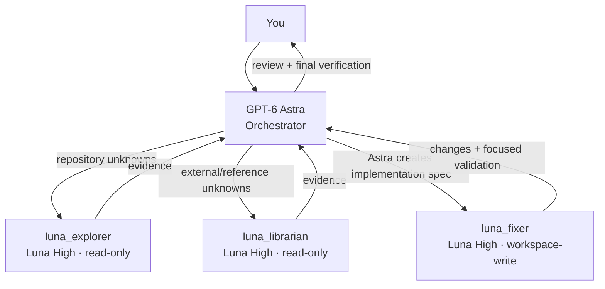

<p align="center">
  
</p>

# Codex Pantheon

Codex Pantheon is a slim, explicit, Codex-native orchestration layer for an Astra-led Codex session.

**v0.6 ports the core Orchestrator → Explorer/Librarian/Fixer behavior of [oh-my-opencode-slim](https://github.com/alvinunreal/oh-my-opencode-slim) onto Codex-native agents while preserving Pantheon's thread-scoped on/off switch.** It does not embed or depend on the OpenCode plugin runtime.

> **Astra decides. Luna specialists execute their lane.**

**Astra = Orchestrator. Luna = Explorer + Librarian + Fixer.**

## Architecture

- **GPT-6 Astra — main thread / Orchestrator.** Understands the request, gathers evidence when needed, makes architecture and product decisions, creates the implementation specification, delegates, reconciles, reviews, verifies, and owns the final answer.
- **GPT-5.6 Luna High — `luna_explorer`.** Read-only repository reconnaissance. Finds files, symbols, execution paths, ownership, and code evidence. It does not design the solution.
- **GPT-5.6 Luna High — `luna_librarian`.** Read-only documentation/API/upstream/reference research. It does not design the solution.
- **GPT-5.6 Luna High — `luna_fixer`.** Write-enabled implementation specialist. Executes Astra's scoped implementation specification and assigned validation. It does not independently replan or redesign the mission.

The custom agent names intentionally include `luna_` so the Codex app can show which Luna lane is running.



The core dependency is:

```text
Explorer/Librarian evidence → Astra plan/specification → Fixer implementation → Astra review/verification
```

Astra may directly handle one isolated, clear, low-risk action when delegation would cost more than execution. It is **not** the default implementation worker for substantive work.

## Operating profiles

| Profile | Activation | Behavior |
| --- | --- | --- |
| Ordinary Codex | default | Pantheon does nothing; normal Codex behavior |
| Pantheon Daily | `$pantheon-daily` | Same role ownership, conservative delegation, no parallel child calls |
| Full Pantheon | `$pantheon` | Same role ownership, more aggressive specialist use and justified parallelism |

Both Pantheon profiles are sticky only inside the current thread. Invoke the other profile to switch. Say `Stop using Pantheon.` to return to ordinary Codex. Nothing persists across threads.

### Pantheon Daily

Daily protects usage by changing **how readily Astra delegates**, not by changing who owns planning or implementation. There is no numeric worker-call ceiling.

Known implementation:

```text
Astra plan → Luna Fixer → Astra review
```

Unknown implementation:

```text
Luna Explorer and/or Librarian → Astra plan → Luna Fixer → Astra review
```

Daily never parallelizes children, but a necessary sequential research/exploration pass followed by Fixer is valid. It must not burn a single allowed call on reconnaissance and then make Astra implement the substantive change; the old v0.5 `0-1` rule is gone.

### Full Pantheon

Full Pantheon uses the same ownership boundaries with fewer delegation constraints. Astra may parallelize independent Explorer/Librarian lanes and may use multiple Fixers only when write ownership is clearly non-overlapping.

There is no `$pantheon-team`, no fast/normal/deep layer, and no Oracle/Designer/Reviewer/Verifier child roster.

## Request-scoped workflows

```text
$pantheon-plan Plan the migration without implementing it.
$pantheon-review Review this branch against main and give me a merge verdict.
```

`$pantheon-plan` keeps the plan with Astra and may use only read-only Explorer/Librarian evidence. Fixer is not used.

`$pantheon-review` keeps the review and verdict with Astra and may use only read-only Explorer/Librarian evidence. A review-only request does not use Fixer or modify production source.

These workflows do not activate a sticky Pantheon profile by themselves.

## Context discipline

Every Pantheon child spawn defaults to native `fork_turns: "none"` with a self-contained bounded assignment. Inherit only the minimum supported context required by a genuine dependency. Full-history inheritance is never the default.

Every assignment names the objective, scope, relevant constraints/context, permission boundary, expected evidence/output, stopping condition, and a prohibition on spawning subagents.

## Install with Codex

Open the Pantheon source directory in Codex and ask:

```text
Install Codex Pantheon for me.
```

The repository instructions direct Codex to run:

```bash
./pantheon bootstrap
```

That installs/updates Pantheon-owned files and runs `doctor`. It does **not** activate Pantheon mode.

### Manual install/update

```bash
./pantheon bootstrap
```

or:

```bash
./pantheon install
./pantheon doctor
```

Pantheon v0.6 installs:

- `${CODEX_HOME:-~/.codex}/agents/luna-explorer.toml`
- `${CODEX_HOME:-~/.codex}/agents/luna-librarian.toml`
- `${CODEX_HOME:-~/.codex}/agents/luna-fixer.toml`
- the `pantheon`, `pantheon-daily`, `pantheon-plan`, and `pantheon-review` skills
- one managed policy block in `${CODEX_HOME:-~/.codex}/AGENTS.md`
- `${CODEX_HOME:-~/.codex}/.pantheon-version`

Updating removes Pantheon's v0.5 `pantheon-worker.toml`, the older v0.4 specialist files, and the old `pantheon-team` skill. Unrelated Codex agents, skills, and text outside the managed markers remain user-owned.

## Doctor

```bash
./pantheon doctor
```

Doctor is read-only. It checks source/package integrity, all three named Luna agents, the four skills, legacy cleanup, managed policy drift, and Codex executable discovery. It does not prove live model/provider availability or a successful native child spawn.

## Uninstall

```bash
./pantheon uninstall
```

Uninstall removes current and legacy Pantheon-owned paths while preserving unrelated Codex configuration.

## Documentation

- [User guide](docs/USER_GUIDE.md)
- [Codex-assisted install guide](docs/CODEX_INSTALL.md)
- [CLI reference](docs/CLI_REFERENCE.md)
- [Design doctrine](docs/DESIGN_DOCTRINE.md)
- [v0.6 release notes](docs/V0.6.0.md)
- [Third-party notices](THIRD_PARTY_NOTICES.md)
- [Changelog](CHANGELOG.md)

## What Pantheon intentionally does not do

Core Pantheon has no automatic prompt interception, proactive activation, recursive agent tree, custom orchestration runtime, persistent mission database, token/quota meter, scheduler, daemon, dashboard, or hidden cross-thread state.

> Enhance Codex. Don't replace it.

## License

Codex Pantheon is available under the [MIT License](LICENSE). Portions of the v0.6 role/routing semantics are adapted from the MIT-licensed `oh-my-opencode-slim`; see [THIRD_PARTY_NOTICES.md](THIRD_PARTY_NOTICES.md).
