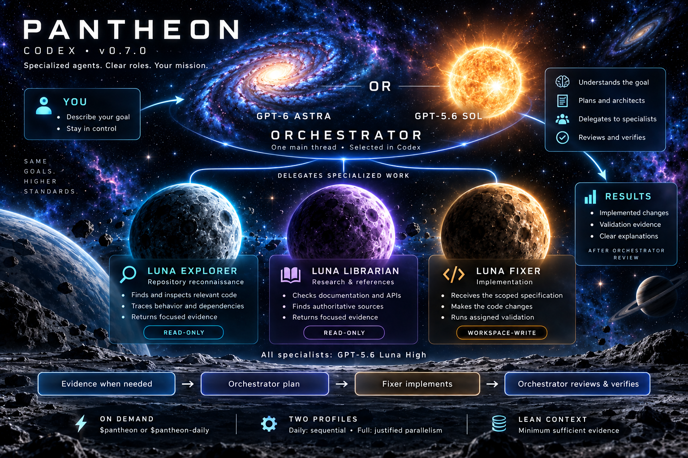

<p align="center">
  
</p>

# Codex Pantheon

Codex Pantheon is a slim, explicit, Codex-native orchestration layer for a supported main-thread Orchestrator.

**v0.7.0 makes the Orchestrator interchangeable between GPT-6 Astra and GPT-5.6 Sol, removes model-specific prompt coupling, and further compresses parent/child context while preserving the Explorer/Librarian/Fixer ownership model.**

> **Orchestrator decides. Luna specialists execute their lane.**

**Astra or Sol = Orchestrator. Luna = Explorer + Librarian + Fixer.**

<p align="center">
  
</p>

[View the detailed architecture diagram](docs/assets/codex-pantheon-v0.7-architecture.svg) · [Graphics and generation brief](docs/assets/GRAPHICS.md)

## Architecture

- **GPT-6 Astra or GPT-5.6 Sol — main thread / Orchestrator.** Understands the request, gathers evidence when needed, makes architecture/product decisions, creates the implementation specification, schedules/delegates work, reconciles results, reviews, verifies, and owns the final answer. It never implements repository changes.
- **GPT-5.6 Luna High — `luna_explorer`.** Read-only repository reconnaissance. Finds files, symbols, execution paths, ownership, and code evidence. It does not design the solution.
- **GPT-5.6 Luna High — `luna_librarian`.** Read-only documentation/API/upstream/reference research. It does not design the solution.
- **GPT-5.6 Luna High — `luna_fixer`.** Write-enabled implementation specialist. Executes the Orchestrator's scoped specification and assigned validation. It does not independently replan or redesign the mission.

The core dependency is:

```text
Explorer/Librarian evidence when needed → Orchestrator plan/specification → Fixer implementation → Orchestrator review/verification
```

Every implementation edit goes through Luna Fixer, even a tiny or obvious change. If Fixer cannot be spawned or complete the assignment, the Orchestrator rescop es, retries, redelegates, or reports the blocker; it never takes over implementation.

## Selecting Astra or Sol

Pantheon deliberately does not maintain a second model selector.

1. Select **GPT-6 Astra** or **GPT-5.6 Sol** with Codex's native main-thread model control.
2. Invoke `$pantheon` or `$pantheon-daily`.
3. The selected supported main-thread model follows the same Pantheon Orchestrator contract.

Pantheon does not switch the active main model, write a duplicate model preference, or spawn an Astra/Sol child. This keeps Codex as the source of truth, avoids an extra model hop, eliminates selector drift, and means switching between Astra and Sol never requires reinstalling Pantheon.

## Why v0.7.0 is leaner

v0.7.0 keeps the role boundaries but removes unnecessary model-personality coupling:

- The installed policy and all four skills refer to the **Orchestrator role**, not to Astra-specific ownership.
- Luna receives assignments from the **Orchestrator**, so the same child prompts work unchanged under Astra or Sol.
- Luna prompts are shorter and ask for the **minimum sufficient evidence** rather than broad output.
- Every Pantheon child explicitly selects a configured Luna role instead of inheriting the Orchestrator model.
- Child context stays deliberately narrow: a V1 parent surface uses `fork_context: false`; a V2 parent surface uses `fork_turns: "none"`.
- No second Orchestrator, model-router runtime, persistent selector, duplicate skill set, hidden state, or additional worker was added.

## Luna is the worker model

Pantheon workers are always `luna_explorer`, `luna_librarian`, or `luna_fixer`. Those installed role files pin **GPT-5.6 Luna High**, and current Codex model metadata marks GPT-5.6 Luna as **MultiAgent V1**.

Astra/Sol may expose a V2 `spawn_agent` tool because that is the **parent Orchestrator's** collaboration surface. That does not make the worker a V2 Astra/Sol child. Pantheon must explicitly pass the configured Luna `agent_type`, so the spawned worker resolves to GPT-5.6 Luna rather than inheriting the parent model.

- **V1 parent transport:** select the Luna `agent_type` and use `fork_context: false`.
- **V2 parent transport:** select the Luna `agent_type`, use `fork_turns: "none"`, and provide the concise `task_name` required by Codex as routing/path metadata only.
- A task name never establishes worker identity. If Codex cannot expose or honor configured-role selection, Pantheon reports the limitation rather than silently creating a generic/inherited child.
- Whether the Luna child gets its own user-editable composer remains a Codex Desktop/runtime behavior; Pantheon does not fake that capability.

The Orchestrator stays in the main thread and is never spawned merely to create a display-only child card.

## Operating profiles

| Profile | Activation | Behavior |
| --- | --- | --- |
| Ordinary Codex | default | Pantheon does nothing; normal Codex behavior |
| Pantheon Daily | `$pantheon-daily` | Same role ownership, conservative delegation, no parallel child calls |
| Full Pantheon | `$pantheon` | Same role ownership, more aggressive specialist use and justified parallelism |

Both Pantheon profiles are sticky only inside the current thread. Invoke the other profile to switch. Say `Stop using Pantheon.` to return to ordinary Codex. Nothing persists across threads.

### Pantheon Daily

Daily protects usage by changing how often optional evidence specialists are used, never who owns implementation. There is no numeric worker-call ceiling.

Known implementation:

```text
Orchestrator plan → Luna Fixer → Orchestrator review
```

Unknown implementation:

```text
Luna Explorer and/or Librarian → Orchestrator plan → Luna Fixer → Orchestrator review
```

Daily never parallelizes children. Luna Fixer remains mandatory for implementation.

### Full Pantheon

Full Pantheon uses the same ownership boundaries with fewer delegation constraints. It may parallelize independent Explorer/Librarian lanes and may use multiple Fixers only when write ownership is clearly non-overlapping.

There is no `$pantheon-team`, no fast/normal/deep layer, and no Oracle/Designer/Reviewer/Verifier child roster.

## Request-scoped workflows

```text
$pantheon-plan Plan the migration without implementing it.
$pantheon-review Review this branch against main and give me a merge verdict.
```

`$pantheon-plan` keeps the plan with the main-thread Orchestrator and may use only read-only Explorer/Librarian evidence. Fixer is not used.

`$pantheon-review` keeps the review and verdict with the main-thread Orchestrator and may use only read-only Explorer/Librarian evidence. A review-only request does not use Fixer or modify production source.

These workflows do not activate a sticky Pantheon profile by themselves.

## Context discipline

Every Pantheon worker is explicitly selected as a Luna role. The parent transport then uses the narrowest fresh-child behavior available: V1 uses `fork_context: false`; V2 uses `fork_turns: "none"`. Full-history inheritance is never the default.

Every child receives a minimum self-contained bounded assignment containing the objective, scope, known constraints/facts, permission boundary, expected evidence/output, stopping condition, and a prohibition on spawning subagents.

## Platform support

Pantheon keeps one shared payload under `agents/`, `skills/`, and `policy/` and exposes platform-native lifecycle frontends:

- **macOS/Linux:** Bash — `pantheon` and `install.sh`
- **Windows:** PowerShell — `pantheon.ps1` and `install.ps1`

Both frontends install the same Luna agents, four Pantheon skills, managed `AGENTS.md` block, and version marker.

## Install with Codex

Open the Pantheon source directory in Codex and ask:

```text
Install Codex Pantheon for me.
```

Bootstrap installs/updates Pantheon-owned files and runs `doctor`. It does **not** activate Pantheon mode.

### macOS/Linux

```bash
./pantheon bootstrap
```

### Windows

```powershell
.\pantheon.ps1 bootstrap
```

`CODEX_HOME` and `PANTHEON_SKILLS_HOME` override the default Codex/skill homes on every platform.

## Installed payload

Pantheon installs:

- `<Codex home>/agents/luna-explorer.toml`
- `<Codex home>/agents/luna-librarian.toml`
- `<Codex home>/agents/luna-fixer.toml`
- the `pantheon`, `pantheon-daily`, `pantheon-plan`, and `pantheon-review` skills
- one managed policy block in `<Codex home>/AGENTS.md`
- `<Codex home>/.pantheon-version`

Updating continues to remove Pantheon's v0.5 `pantheon-worker.toml`, older v0.4 specialist files, and old `pantheon-team` skill while preserving unrelated Codex state.

## Doctor

macOS/Linux:

```bash
./pantheon doctor
```

Windows:

```powershell
.\pantheon.ps1 doctor
```

Doctor is read-only. It checks package/install integrity and Codex executable discovery. It does not prove live model/provider availability or a successful native child spawn.

## Uninstall

```bash
./pantheon uninstall
```

or on Windows:

```powershell
.\pantheon.ps1 uninstall
```

Uninstall removes Pantheon-owned current and legacy paths while preserving unrelated Codex configuration.

## Documentation

- [User guide](docs/USER_GUIDE.md)
- [Codex-assisted install guide](docs/CODEX_INSTALL.md)
- [CLI reference](docs/CLI_REFERENCE.md)
- [Design doctrine](docs/DESIGN_DOCTRINE.md)
- [v0.7.0 release notes](docs/V0.7.0.md)
- [Third-party notices](THIRD_PARTY_NOTICES.md)
- [Changelog](CHANGELOG.md)

## What Pantheon intentionally does not do

Core Pantheon has no automatic prompt interception, proactive activation, recursive agent tree, custom orchestration/model-routing runtime, persistent mission database, token/quota meter, scheduler, daemon, dashboard, or hidden cross-thread state.

> Enhance Codex. Don't replace it.

## License

Codex Pantheon is available under the [MIT License](LICENSE). Portions of the role/routing semantics are adapted from the MIT-licensed `oh-my-opencode-slim`; see [THIRD_PARTY_NOTICES.md](THIRD_PARTY_NOTICES.md).
