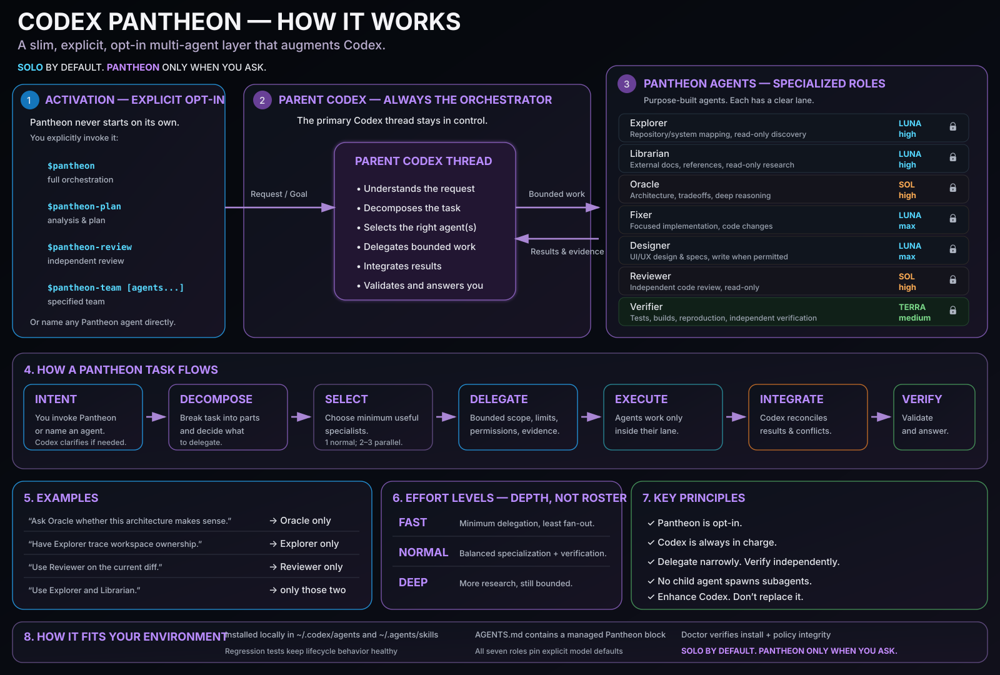

# Codex Pantheon

**Codex Pantheon is a slim, explicit, Codex-native multi-agent layer.**

Pantheon gives Codex a small set of specialist agents plus thin planning, review, and parallel-team workflows without replacing Codex with a separate orchestration framework.

> Enhance Codex. Don't replace it.



## v0.2.0

v0.2 adds coordination and reliability while preserving Pantheon's original constraints:

- ordinary Codex stays solo by default;
- Pantheon activates only when you explicitly request it;
- the parent Codex thread remains the orchestrator;
- child agents receive bounded assignments and cannot recursively spawn Pantheon agents;
- one specialist is preferred over unnecessary fan-out;
- independent review/verification is available when it materially improves confidence;
- no daemon, task database, scheduler, HUD, or custom orchestration runtime is introduced.

See `docs/DESIGN_DOCTRINE.md` and `docs/V0.2.0.md`.

## Core agents

| Agent | Purpose | Default model | Reasoning | Default write posture |
| --- | --- | --- | --- | --- |
| `pantheon_explorer` | Repository/system mapping, execution-path tracing, evidence | `gpt-5.6-luna` | `medium` | Read-only |
| `pantheon_librarian` | Docs, APIs, standards, upstream/reference research | `gpt-5.6-luna` | `medium` | Read-only |
| `pantheon_oracle` | Architecture, tradeoffs, difficult reasoning | `gpt-5.6` | `high` | Read-only |
| `pantheon_fixer` | Focused implementation | `gpt-5.6-luna` | `max` | Workspace write |
| `pantheon_designer` | UI/UX critique or explicitly authorized UI implementation | `gpt-5.6` | `high` | Assignment-dependent |
| `pantheon_reviewer` | Independent correctness/regression/security review | `gpt-5.6` | `high` | Read-only |
| `pantheon_verifier` | Tests, builds, reproduction, acceptance evidence | `gpt-5.6-terra` | `medium` | No production-source edits |

All seven v0.2 agent roles now pin explicit model and reasoning defaults. `gpt-5.6` is the GPT-5.6 Sol alias.

## Workflow skills

Invoke Pantheon explicitly:

```text
$pantheon investigate and fix this race
$pantheon fast map where this setting is persisted
$pantheon deep redesign this subsystem and verify the change
$pantheon-plan plan the multi-workspace migration without implementing it
$pantheon-review review this branch against main
$pantheon-team split this migration into independent workstreams
```

You can also name an agent directly in natural language, for example:

```text
Use Pantheon Explorer to map the authentication flow.
Use Pantheon Reviewer to independently inspect the current diff.
```

Pantheon does not activate merely because a task looks difficult.

## Install with Codex (recommended)

Open the Pantheon source directory as your Codex workspace and simply ask:

```text
Install Codex Pantheon for me.
```

The repository instructions direct Codex to run the bounded bootstrap flow:

```bash
./pantheon bootstrap
```

`bootstrap` installs or refreshes Pantheon-owned files and immediately runs `doctor`. If a safety check fails, Codex is instructed to report the failure instead of bypassing Pantheon's safeguards with manual overwrites. See `docs/CODEX_INSTALL.md`.

### Manual install

From the Pantheon source directory:

```bash
./pantheon install
./pantheon doctor
```

The v0.1-compatible entry point still works:

```bash
./install.sh
```

Pantheon installs:

- custom agent TOMLs into `${CODEX_HOME:-~/.codex}/agents/`;
- workflow skills into `~/.agents/skills/`;
- one managed policy block into `${CODEX_HOME:-~/.codex}/AGENTS.md`;
- a small version marker at `${CODEX_HOME:-~/.codex}/.pantheon-version`.

Agent files are copied as regular files. Pantheon does not install custom agent roles as symlinks.

The installer is idempotent: running it repeatedly should produce the same installed state without duplicating the managed `AGENTS.md` block.

## Bootstrap / Update

For Codex-assisted setup and the simplest manual install-or-update flow:

```bash
./pantheon bootstrap
```

For an explicit update after replacing/pulling the Pantheon source with a newer version:

```bash
./pantheon update
```

`update` replaces only Pantheon-owned agent/skill files and Pantheon's managed `AGENTS.md` block. Text outside the markers remains user-owned.

## Doctor

```bash
./pantheon doctor
```

Doctor is read-only. It checks:

- source package completeness;
- installed version marker;
- all seven custom-agent files;
- regular-file/no-symlink status;
- agent and skill drift against this package;
- all four workflow skills;
- managed `AGENTS.md` marker integrity and content;
- possible legacy/unmanaged Pantheon text;
- whether a Codex executable can be found and its reported version.

Doctor validates the installation, not the live Codex service/backend. A healthy doctor result therefore does not claim that a real subagent spawn has been exercised successfully in the current Codex build/provider.

## Uninstall

```bash
./pantheon uninstall
```

Uninstall removes only Pantheon-owned agent files, Pantheon skill directories, the Pantheon managed block, and the Pantheon version marker. Other Codex configuration and other skills are preserved.

## Managed `AGENTS.md` policy

Pantheon owns only the region bounded by:

```text
<!-- PANTHEON:START -->
...
<!-- PANTHEON:END -->
```

If the markers are malformed or duplicated, install/update/uninstall refuses to rewrite `AGENTS.md` rather than guessing.

### Upgrading from v0.1

If v0.1 left unmarked Pantheon instructions in `~/.codex/AGENTS.md`, v0.2 intentionally does not delete them because they are indistinguishable from user-owned text. Install v0.2, run `./pantheon doctor`, then review any legacy-warning text manually once the managed block is present.

## Configuration locations

Pantheon honors `CODEX_HOME` for Codex-owned files:

```bash
CODEX_HOME=/tmp/codex-home ./pantheon install
```

For tests or unusual environments, the skill root can be overridden with:

```bash
PANTHEON_SKILLS_HOME=/tmp/skills ./pantheon install
```

## Development validation

Run:

```bash
./tests/test.sh
```

The test suite uses isolated temporary homes and does not touch your real Codex configuration.

## What Pantheon intentionally does not do

Core Pantheon has no:

- automatic prompt interception or mode detection;
- proactive activation on ordinary Codex prompts;
- recursive child-agent orchestration;
- background daemon or service;
- persistent mission/task database;
- tmux/worktree scheduler;
- orchestration dashboard/HUD;
- token or rate-limit manager;
- large agent marketplace;
- custom MCP orchestration server.

If a future feature requires Pantheon to become its own agent platform rather than improving native Codex delegation, it fails the project's slim test by default.
